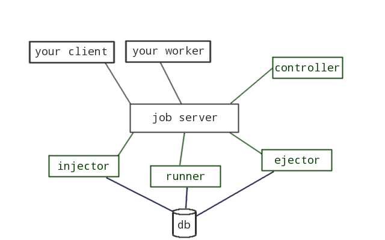
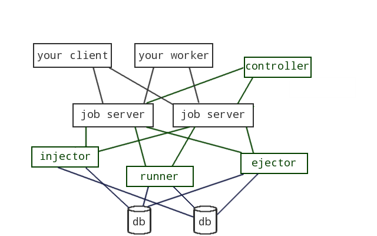

# gearsloth

Gearsloth is a system that enables delayed tasks and persistent storage schemes
in Gearman job server. The gearsloth stack consists of four components: injector,
runner, controller and ejector. Gearsloth
supports a database backend architecture which abstracts persisting delayed
tasks to a database. Gearsloth is written in Node.js.



This is the simplest gearsloth configuration. Gearsloth's components are marked with green.



As seen above, one may add more Gearman job servers and databases to the configuration in order to make
the system more *robust*. Multiple instances of injector/runner/controller/ejector may also be run.

## Installation

    npm install gearsloth

## Components

### Injector

The injector registers the function `submitJobDelayed` to Gearman job server(s). The task to be delayed should be sent to the injector in the format specified in [task format specification](#task-format-specification).

If the task is succesfully inserted in to the persistent storage, injector will send gearman `WORK_COMPLETE` to the caller. This means that the task *will* be executed.

#### Error handling

If there is an error parsing the task, or if the injector fails to insert the task to the persistent storage, it will send `WORK_WARNING` with the appropriate error message followed by `WORK_FAIL` to the caller. This always means that the job *will not* be executed.

#### Events

* `connect`: will be emitted when the injector is connected to at least one Gearman job server.
* `disconnect`: will be emitted when the injector has lost connection to all Gearman job servers.

### Runner

TODO: Write me!

### Controller

TODO: Documentation for default controller!
TODO: Documentation for developing controllers!

Controllers encapsulate a specific task retry strategy which governs when and
how a failing task is retried/failed. Controllers publish a gearman function
which is called by the runner on task expiry time. Gearslothd daemon
implements a default controller but users can implement custom controllers with
custom retry strategies and choose the controller they want to use on runtime
by specifying the controller gearman function name and a controller-specific
configuration object when submitting a delayed task.

Custom controllers must expose a gearman function that accepts a task object
that contains the name of the function that controller is expected to call
and a payload. The task object also contains an id that needs to be passed
on to the ejector component when the task has completed.

In a nutshell, a controller does the following:

1.  Publish a controller function that accepts a task object. This task object
    contains a `.func_name` and an optional `.payload`. The task object may
    also contain any custom fields set by the original client that the
    controller component may interpret freely.
2.  On receiving a task object from a runner component, call the gearman
    function `.func_name` with the payload `.payload`.
3.  When the task completes, pass the task object to the ejector component
    (gearman function `delayedJobDone`). The field `.id` that identifies a task
    must be passed to the ejector unchanged.

### Ejector

TODO: Write me!

## Configuration

Gearslothd daemon by default reads a JSON configuration file gearsloth.json from
the current directory. The daemon also accepts the following command line
configuration options:

`./bin/gearslothd [options] [hostname[:port]]`

* `-i, --injector`: Run the daemon as injector.
* `-v, --verbose`: Configure logging
* `-r, --runner`: Run the daemon as runner.
* `-c, --controller`: Run the daemon as default controller.
* `-e, --ejector`: Run the daemon as ejector.
* `--controllername`: Specify the controller module by name. Can also be specified in the config file (config.json). If the input contains forward slashes, the module is looked up in relation to your current dir. The logic for handling --controllername can be found in /lib/config/index.js.
* `--db`: Specify the database module by name. Can also be specified in the config file. If the input contains forward slashes, the module is looked up in relation to your current dir.
* `--verbose`: Specify logging level; You can use the --verbose or -v flag multiple times for the following effects:
  * No flag (default): notice -> std.out | errors -> std.err
  * One flag (-v): notice, info -> std.out | errors -> std.err
  * Two flags (-vv): notice, info, debug -> std.out | errors -> std.err  
> You can also configure this parameter with and integer (0 for one flag, 1 for two flags) in gearsloth.json.
The logic for handling the --verbose flag can be found in lib/log.js.

* `-f, --file=FILENAME`: Define the JSON configuration file. By default
  `gearsloth.json` in the currenct directory will be used. Options specified
  in this file are overwritten by any options defined by command line options.
* `    --conf=JSON`: Provide a JSON formatted configuration object on the
  command line. Any options defined by this object are overwritten by other
  command line options.
* `    --db=NAME`: Database adapter to be used by the daemon. By default `sqlite`
  is used.
* `    --dbopt=JSON`: Provide a JSON formatted freefirn configuration object for
  the database adapter.
* `    --servers=JSON`: Provide a JSON formatted gearman server list array.
  The server list will be overwritten by a hostname given as a positional
  command line parameter.

The daemon runs in all modes if no modes are specified. Any mode set in the
command line arguments overrides all mode settings in the configuration file.

### Configuration object formats

The configuration file consists of a single JSON object. The following fields
are interpreted:

* `.injector {Boolean}`: If true, run as injector.
* `.runner {Boolean}`: If true, run as runner.
* `.controller {Boolean}`: If true, run as default controller.
* `.ejector {Boolean}`: If true, run as ejector.
* `.db {String}`: Database adapter name.
* `.dbopt {Object}`: A freeform object that may be interpreted by the database
  adapter.
* `.servers {[Object]}`: A list of gearman servers that are connected to. The
  servers may contain fields `.host` and `.port`. If only one the fields is
  specified, a default value is used. The default gearman server is
  `localhost:4730`.
* `.db {String}`: Database module name.
* `.controllername {String}:` Controller module name. See above for a more detailed description.
* `.verbose {Integer}`: Desired logging detail level. See above for a more detailed description.

### Configuration file location

By default, Gearsloth will look for the configuration file in your current directory. If the file is not found, Gearsloth will then look for it in the following locations (in order):

* 1) your current directory
* 2) .home/.gearsloth/gearsloth.json
* 3) ./etc/gearsloth/gearsloth.json
* 4) .”gearsloth installation dir”/gearsloth.json

The logic for finding the configure file can be found in lib/config/defaults.js

### Example configuration

#### `gearsloth.json`

    {
      "db": "sqlite",
      "servers": [{ "host": "meetin.gs" }]
    }

    > ./bin/gearsloth -ire --dbopt='{"db_name": "in-memory"}'

Runs a daemon in injector, runner and ejector modes using an in-memory
sqlite database and connecting to a single gearman server running on
`meetin.gs:4730`.

## Task format specification

Task is to be a JavaScript JSON object with the following format:

```
var task = {
   func_name: name of the function (Gearman task) to be executed,
          at: time of execution (optional),
       after: seconds after which this task is to be executed (optional),
  controller: name of the controller function that is to handle execution of the task (optional),
     payload: the payload that is to be passed to the function (task) (optional),
  runner_retry_timeout: the number of seconds after which one of the registered runners for this tasks func_name
                        (the database adapter picks one for each retry) will pick up the task again
                        in case the first runner was unable to pass the
                        task on for execution (to a worker). After a runner picks up the task this field
                        is updated instantly in the database. This field is optional,
  runner_retry_count:   the number of times a runner is to retry handling the task if
                        the previous runner was unable to pass the task on for execution (to a worker),
                        each time the database adapter passes this task to a runner, this field
                        is decreased by one (the database is then updated instantly). This field is optional.
}
```

### Description of fields

The only required field for task is `func_name`.

* `func_name`: is to be any string that corresponds to a Gearman function that is registered in the Gearman Job server. The function must be registered in the Gearman Job server at the moment of execution, it is not required earlier. Needless to say, if the function does not exist at execution time it will not be run and the task will likely fail to execute, depending on controllers and settings of the runner at the time of execution.
* `at`: if defined this is any string which is understood by the JavaScript `Date` API. `at` specifies the date and time at which the task is to be executed.
* `after`: if defined it supersedes the `at`. This is any string that is parseable into an integer as representative of *seconds* after which the task is to be executed.
* `controller`: if defined this is any string that corresponds to a Gearman function that has been written to handle the execution of tasks. If omitted a default behavior is adopted at the `runner` level.
* `runner_retry_timeout`: if defined this is any string that is parseable into an integer. See above for a more detailed description.
* `runner_retry_count`: if defined this is any string that is parseable into an integer. See above for a more detailed description.
* `payload`: if defined this can be anything that can be sanely converted into a string. It may also be a JSON object in itself. `payload` will be passed on to the `func_name` function as given or to the `controller` if defined for more processing.

### Internal
* `id`: Set by the database to identify database/table/task. Form may be chosen freely.

In addition the `task` JSON object may contain any number of fields (for example to be passed to the `controller`) These additional fields will not be taken into account in any way in the control flow other than in the custom `controller` if it is to do so.

### Marking jobs as done

After a job is done, a controller should send the task object to the ejector in order to remove it from the task database.

## Database adapters

Currently there are 2 complete adapters: 'sqlite.js', which uses the sqlite3.js npm package, and 'mysql-multimaster.js'.

TODO: Documentation for mysql-multimaster!

### Sqlite3

This adapter requires the sqlite3.js npm package which can be installed by issuing the command:
```
npm install sqlite3
```

#### Configuration

The sqlite-adapter configuration takes in a JSON object that describes the following properties of the database:

* `config.dbopt.table_name`: The name of the table into which the tasks are to be saved. If unset a default value of *"DelayedTasks"* is used.
* `config.dbopt.db_name`: The filename which is used for the database. An 'in-memory' database can be used by providing the `':memory:'` string as the db_name. The 'in-memory' database will be lost once the execution of the process ends, and it will not be accessible to other instances of adapters. An aboslute path to the datbase should be used. If unset a default value of *"/tmp/DelayedTasks.sqlite"* is used.
* `config.dbopt.poll_timeout`: A time value in milliseconds which the adaters database polling function is to timeout before the next query. If unset a default value of *1000* milliseconds is used.
* `config.dbopt.pre_poll`: A time value in secods that is subtracted from the exipry time of the task to accomplish retrieving tasks before they expire. If unset a default value of *0* seconds is used.
* `config.dbopt.default_timeout`: A time value in seconds that the execution of the task is to be timed out right after selection for execution. If unset the adapter will default to *1000* seconds.

The initialization may also be called without any configuration to adopt all default cofigurations, for example:
```
var adapter = require('../../lib/adapters/sqlite');
adapter.initialize(null, someScriptToExecute);
```

#### Notes

None of the functions implemented in the adapter provide rollback, so it is important that they are used correctly. At the moment the database calls are NOT sanitized, all effort will be made to make this happen.

## Database adapter API

The database adapters implement the interface that should be used from within *injectors*, *runners* and *ejectors*. Each adapter implements the following functions in accordance with their specified database type:

* `initialize(configuration, callback)`: Initializes the database connection(s) with given configuration, then calls the callback whilst exporting the actual API into the database. All operations must thus be done inside the callback. See "Examples". The configuration is given as a JSON object and is adapter dependent, see "Configuration".
* `saveTask(task, callback)`: Saves the given `task` JSON object into the database, then calls the callback. If at any point there were errors the callback is called with an error object as the first argument. If the operation succeeded the callback is called with a 'null' error object and the row ID, as the first and second argument respectively.
* `listenTask(callback)`: Listens to (or polls, depending on database type) expiring tasks and calls the callback function with each `task` returned by the database query. On error the callback is called with an error object. If the operation succeeded the callback is called with a 'null' error object and the `task` JSON object, as the first and second argument respectively. A function for halting the `listenTask` function is exported from this, and it can be provided with a callback (see "Examples"). The function will update all result rows, so that no other *runner* may select and pass the tasks on for duplicate execution. By default this is done by delaying the expiry time of the `task` in the database by 1000 seconds. The function also sets the field `task.first_run` to the current date if the `task` is run for the first time.
* `updateTask(task, callback)`: Updates the given `task` JSON object in the database identified by the *task.id* property, then calls the callback. On error the callback is called with an error object, else with a 'null' error object and the number of rows to which the *update* operation had effect, as first and second argument respectively. The number of changed rows should be 1 if update succeeded, and 0 if the task was not found in the database (not present or wrong identifier in the `task` JSON object).
* `completeTask(task, callback)`: Deletes the given `task` from the database. On error the callback is called with an error object. If the operation succeeded the callback is called with a 'null' error object and the number of rows affected by the operation, as first and secdond argument respectively. The number of affected rows should be 1 if the delete operation succeeded, else the task was not found in the database (not present or wrong id in the `task` JSON object).
* `disableTask(task, callback)`: Disables the `task` from being run. On error the callback is called with an error object, else with a 'null' error object and the number of affected rows. This is used then the *runner_retry_count* of the task falls to zero after being non-zero, and action should be taken to take care of the problem. This situation will arise if the *controller* responsible for the task has repeatedly been unavailable or has not called upon the *ejector* to complete the task.

### Developing adapters

The following guidelines should be followed for adapters:

* External functions should be fail-fast, so minimize connection timeouts and queueing by default. Retrying will be handled in the component that uses the adapter.
* Do not throw exceptions, instead propagate errors through callbacks.


## Running tests

    $ npm test

## Running tests in virtualized environment

Gearsloth has tests that simulate a production-like environment
implemented with docker and vagrant. To run these tests issue the following commands:

    $ vagrant up
    $ vagrant ssh

    sloth:~$ cd gearsloth
    sloth:~/gearsloth$ make docker-test
    
## Links
 
 * [Gearman project](http://gearman.org)
 * [Original project description](Doc/legacy-description.md)
