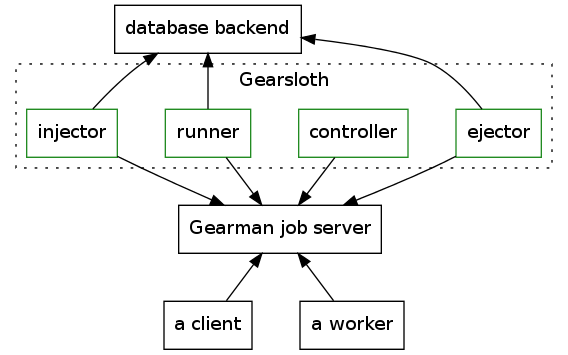

# Gearsloth

[gear]:  http://gearman.org
[deb]:   https://wiki.debian.org/Packaging
[mygit]: https://github.com/felixge/node-mysql#connection-options
[mynpm]: https://www.npmjs.org/package/mysql
[sqnpm]: https://www.npmjs.org/package/sqlite3
[dock]:  http://www.docker.com
[vagr]:  http://www.vagrantup.com


## Contents

 * [Overview](#overview)
 * [Installation](#installation)
 * [Components](#components)
   - [Injector](#injector)
   - [Runner](#runner)
   - [Controller](#controller)
   - [Ejector](#ejector)
 * [Configuration](#configuration)
 * [Task format specification](#task-format-specification)
 * [Database adapters](#database-adapters)
 * [Database adapter API](#database-adapter-api)
 * [Development](#development)
   - [Running tests in virtualized environment](#running-tests-in-virtualized-environment)
   - [Code conventions](#code-conventions)
 * [License](#license)


## Overview

Gearsloth is a system that enables delayed tasks and persistent storage schemes with [Gearman][gear] job server. The Gearsloth stack consists of four components: *injector*, *runner*, *controller* and *ejector*. Gearsloth supports a database backend architecture which abstracts persisting delayed tasks to a database. Gearsloth is written in Node.js.



Gearsloth is setup between Gearman job server and database backend. Any Gearsloth component may have multiple instances running and may be connected to multiple job servers and databases. For production environments, where robustness and resiliency is required, having at least two of each component is highly recommended.

### Configuration examples

Different setups

1.  Dev setup, all on the same server
2.  Parallel sqlite setups (not possible)
3.  Separate components connected to a single mysql
4.  Ubersetup, everything multiplied, including dbs

## Installation

### npm

    # npm install gearsloth -g

### deb

There is a rudimentry support for putting Gearsloth in a Debian package. Instructions to build a Debian package are beyond the scope of this documentation and taking a look at [Debian wiki][deb] is recommended. Following is only an approximation of the process:

1. Install all the software and required dependencies for the build host.

2. Create the package.

    $ dpkg-buildpackage -b -uc

3. Distribute and install the package by means suitable to your infrastructure.

## Components

All components emit the following events:

* `connect`: will be emitted when the component is connected to at least one Gearman job server.
* `disconnect`: will be emitted when the component has lost connection to all Gearman job servers.

They are written in NodeJS but they use the gearman-coffee npm-package for their Gearman worker and client APIs.

### Injector

The injector registers the function `submitJobDelayed` to Gearman job servers. The task to be delayed should be sent to the injector in the format specified in [task format specification](#task-format-specification).

If the task is succesfully inserted in to the persistent storage, injector will send gearman `WORK_COMPLETE` to the caller. This means that the task *will* be executed.

Injectors communicate to the Gearman job server via the normal worker API. They employ connecting to several job servers by creating as many workers as there are servers that function as the communicators to and from the job servers.

#### Error handling

If there is an error parsing the task, or if the injector fails to insert the task to the persistent storage, it will send `WORK_WARNING` with the appropriate error message followed by `WORK_FAIL` to the caller. This always means that the job *will not* be executed.

### Runner

The runner is responsible for forwarding expiring tasks to controller. Runner registers itself as listener to a database adapter that hands out expiring tasks to the runner. Runner updates expiring tasks with a new due time for retry (from the `runner_retry_timeout`) or disables the task from the database if submission of the task has either failed or the task has not for other reasons been removed from the database. A task is disabled if the `.runner_retry_count` reaches zero from a positive integer.

Client can adjust the interval between retries with the task parameter `.runner_retry_timeout` and the total number of retries before task disabling with `.runner_retry_count`. `.runner_retry_timeout` is a number given in seconds. Default timeout value of 1000 seconds is used if `.runner_retry_timeout` is undefined. If `.runner_retry_count` is undefined, the task is retried indefinitely.

Runners communicate to the Gearman job server via the client API. As with injectors they create as many clients as there are job servers to communicate to multiple servers.

### Controller

Controller receives expiring tasks from runner and forwards them to the destination
worker. Controller monitors the task's execution and ejects the task from the system
through the ejector component. Controller is free to choose how to retry an unresponsive
or failing task. Controller publishes a gearman function
which is called by the runner on task expiry time. Gearslothd daemon
implements a default controller but users can implement custom controllers with
custom retry strategies and choose the controller they want to use on runtime
by specifying the controller gearman function name. Runner sends the task
to a gearman function specified by task field `.controller`. If the field
doesn't exist, a preconfigured controller is used. By default `retryController`
gearman function is used.

Custom controllers must expose a gearman function that accepts a task object
that contains the name of the function that controller is expected to call
and a payload. The task object also contains an id that needs to be passed on
unchanged to the ejector component when the task has completed. Controller can also use
any user-specified extra fields on the task object.

In a nutshell, a controller does the following:

1.  Publish a controller function that accepts a task object. This task object
    contains a `.func_name` and an optional `.payload`. The task object may
    also contain any custom fields set by the original client that the
    controller component may interpret freely.
2.  On receiving a task object from a runner component, call the gearman
    function `.func_name` with the payload `.payload`.
3.  When the task completes, pass the task object to the ejector component
    (gearman function `delayedJobDone`). The field `.id` that identifies a task
    must be passed to the ejector unchanged.

#### Default controller

Gearsloth ships with a default 'retry controller' that retries the task
if it receives a `WORK_FAIL` message from the gearman server. The exact
number of times the task is retried can be specified with task field `.retry_count`.
The controller ejects the task if `WORK_COMPLETE` is received. If
`WORK_COMPLETE` never arrives even after specified number of retries, the
task is simply ignored and left to the runner which retries the task
after some time.

#### Custom controllers

Custom controllers can be launched by providing a configuration option `controller_name`
that defines the controller module name or path. The option can be given in a
configuration file or as a command line parameter.

To implement a custom controller you need to adhere to the specification described above.
An example custom controller that simply forwards the given task can be found at
https://github.com/meetings/gearsloth-passthrough-controller. You can install it simply
with npm:

    # npm install gearsloth-passthrough-controller -g

To launch a globally installed gearsloth and passthrough controller connecting to a local gearman server, type:

    $ gearslothd --controllername=gearsloth-passthrough-controller localhost

### Ejector

Ejectors are responsible for removing a task from the database. They register a function named `delayedJobDone` to Gearman job servers. The function must be called with a string parseable to a task JSON object and contain a valid identifier (see [task format specification](#task-format-specification)). Ejectors, upon recieving a task, will call the database adapter function `completeTask` which then removes the task from the database IF it contained a valid identifier.

Currently if the system is setup to use the `sqlite` adapter the ejector(s) (in fact the whole Gearsloth stack) need to be running on the same filesystem as the database is saved to a file and is not accessible directly through a network. This does not apply to a properly configured `mysql` adapter since it is by default network accessed.

The Gearsloth system will likely fail if it is setup to use separate databases which are not accessible from all components: it is possibile that a task extracted from database A will have the same identifier as a task extraced from database B and that the `ejector` that recieves the task for removal will be connected to database B and thus removes the wrong task. It is highly recommended that the system is setup to use mysql-databases if more than one database is required.

As with the other components the ejectors use multiple instances of workers from the gearman-coffee package, again one per job server, for communication to multiple job servers.

## Configuration

By default gearslothd expects to find a JSON configuration file from [specified locations](#configuration-file-location). Following command line options are accepted **and they override any configuration file options**:

    $ ./bin/gearslothd [options] hostname[:port]

* `-i, --injector`: Run the daemon as injector.
* `-r, --runner`: Run the daemon as runner.
* `-c, --controller`: Run the daemon as default controller.
* `-e, --ejector`: Run the daemon as ejector.
* `--controllername`: Specify the controller module by name. This can also be specified in the configuration file. If the input contains forward slashes, the module is looked up in relation to your current directory. The logic for handling this option can be found in *lib/config/index.js*.
* `--db`: Specify the database module by name. Can also be specified in the config file. If the input contains forward slashes, the module is looked up in relation to your current dir.
* `--verbose`: Specify logging level; You can use the --verbose or -v flag multiple times for the following effects:
  * None (default): notice -> std.out | errors -> std.err
  * Once (`-v`): notice, info -> std.out | errors -> std.err
  * Twice (`-vv`): notice, info, debug -> std.out | errors -> std.err
| You can also configure this parameter with and integer (0 for one flag, 1 for two flags) in configuration file. The logic for handling the flag can be found in *lib/log.js*.
* `-f, --file=FILENAME`: Define the path to configuration file. See [this](#configuration-file-location) for details.
* `--conf=JSON`: Provide a JSON formatted configuration object on the command line. Please, do take care of escaping the JSON data properly.
* `--db=NAME`: Database adapter to be used by the daemon. Default is to use `sqlite` adapter.
* `--dbopt=JSON`: Provide a JSON formatted freeform configuration object for the database adapter.
* `--servers=JSON`: Provide a JSON formatted Gearman job server list.

By default the daemon runs in all modes.

### Configuration object formats

The configuration file consists of a single JSON object. The following fields
are interpreted:

* `.injector {Boolean}`: If true, run as injector.
* `.runner {Boolean}`: If true, run as runner.
* `.controller {Boolean}`: If true, run as default controller.
* `.ejector {Boolean}`: If true, run as ejector.
* `.db {String}`: Database adapter name.
* `.dbopt {Object}`: A freeform object that may be interpreted by the database
  adapter.
* `.servers {[Object]}`: A list of gearman servers that are connected to. The
  servers may contain fields `.host` and `.port`. If only one the fields is
  specified, a default value is used. The default gearman server is
  `localhost:4730`.
* `.db {String}`: Database module name.
* `.controllername {String}:` Controller module name. See above for a more detailed description.
* `.verbose {Integer}`: Desired logging detail level. See above for a more detailed description.

### Configuration file location

Gearsloth daemon will look for a configuration file named `gearsloth.json` in the following locations in the following order:

1. Current working directory
2. `$HOME/.gearsloth`
3. `/etc/gearsloth`
4. Gearsloth project directory

See *lib/config/defaults.js* for details.

### Example configuration

#### `gearsloth.json`

    {
      "db": "sqlite",
      "servers": [{ "host": "127.0.0.1" }]
    }

#### Command line

    $ ./bin/gearslothd -ire --dbopt='{"db_name": "in-memory"}'

Runs a daemon in *injector*, *runner* and *ejector* modes using an in-memory SQLite database and connecting to a single Gearman job server running on `127.0.0.1:4730`.

### More example configurations

See `examples` directory for additional example configurations.


## Task format specification

Task is to be a JavaScript JSON object with the following format:

```
var task = {
           func_name: name of the gearman function to be executed,
    func_name_base64: binary name of the target gearman function in base64 encoding (optional, overrides func_name),
                  at: time of execution (optional),
               after: seconds after which this task is to be executed (optional),
          controller: name of the controller function that is to handle execution of the task (optional),
             payload: payload that is passed to the target function (optional),
      payload_base64: binary payload in base64 encoding that is passed to the target fucntion (optional, overrides payload),
runner_retry_timeout: the number of seconds after which one of the registered runners for this tasks func_name
                      (the database adapter picks one for each retry) will pick up the task again
                      in case the first runner was unable to pass the
                      task on for execution (to a worker). After a runner picks up the task this field
                      is updated instantly in the database. This field is optional,
  runner_retry_count: the number of times a runner is to retry handling the task if
                      the previous runner was unable to pass the task on for execution (to a worker),
                      each time the database adapter passes this task to a runner, this field
                      is decreased by one (the database is then updated instantly). This field is optional.
         retry_count: number of times the task is retried in default controller (optional, only used in default controller)
}
```

### Description of fields

The only required field for task is `func_name`.

* `func_name`: is to be any string that corresponds to a Gearman function that is registered in the Gearman Job server. The function must be registered in the Gearman Job server at the moment of execution, it is not required earlier. Needless to say, if the function does not exist at execution time it will not be run and the task will likely fail to execute, depending on controllers and settings of the runner at the time of execution.
* `at`: if defined this is any string which is understood by the JavaScript `Date` API. `at` specifies the date and time at which the task is to be executed.
* `after`: if defined it supersedes the `at`. This is any string that is parseable into an integer as representative of *seconds* after which the task is to be executed.
* `controller`: if defined this is any string that corresponds to a Gearman function that has been written to handle the execution of tasks. If omitted a default behavior is adopted at the `runner` level.
* `runner_retry_timeout`: if defined this is any string that is parseable into an integer. See above for a more detailed description.
* `runner_retry_count`: if defined this is any string that is parseable into an integer. See above for a more detailed description.
* `payload`: if defined this can be anything that can be sanely converted into a string. It may also be a JSON object in itself. `payload` will be passed on to the `func_name` function as given or to the `controller` if defined for more processing.

### Internal
* `id`: Set by the database to identify database/table/task. Form may be chosen freely.

In addition the `task` JSON object may contain any number of fields (for example to be passed to the `controller`) These additional fields will not be taken into account in any way in the control flow other than in the custom `controller` if it is to do so.

### Marking jobs as done

After a job is done, a controller should send the task object to the ejector in order to remove it from the task database.

## Database adapters

Currently, there are two database backend adapters.

Well, ok, there is a third adapter named `composite`, but it is likely to be deprecated soon, so it is not documented at all.

### SQLite

This adapter requires the [sqlite3][sqnpm] package, which can be installed with *npm*:
```
$ npm install sqlite3
```

#### Configuration

The sqlite-adapter configuration takes in a JSON object that describes the following properties of the database:

* `dbopt.table_name`: The name of the table into which the tasks are to be saved. If unset a default value of *DelayedTasks* is used.
* `dbopt.db_name`: The filename which is used for the database. An in-memory database can be used by providing the `:memory:` string as the db\_name. The in-memory database will be lost once the execution of the process ends, and it will not be accessible to other instances of adapters. An absolute path to the database should be used. If unset, a default value of *DelayedTasks.sqlite* is used.
* `dbopt.poll_timeout`: A time value in milliseconds which the adaters database polling function is to timeout before the next query. If unset a default value of *1000* milliseconds is used.
* `dbopt.pre_poll`: A time value in seconds that is subtracted from the expiry time of the task to accomplish retrieving tasks before they expire. If unset, a default value of *0* seconds is used.
* `dbopt.default_timeout`: A time value in seconds that the execution of the task is to be timed out right after selection for execution. If unset, the adapter will default to *1000* seconds.

The initialization may also be called without any configuration to adopt all default configurations, for example:
```
var adapter = require('../../lib/adapters/sqlite');
adapter.initialize(null, someScriptToExecute);
```

#### Notes

None of the functions implemented in the adapter provide rollback, so it is important that they are used correctly. At the moment the database calls are **not sanitized**, all effort will be made to make this happen.

### Mysql

This adapter requires the [mysql][mynpm] package, which can be installed with *npm*:
```
$ npm install mysql
```

#### Caveat

Mysql adapter is designed to support Mysql multi-master replication configurations, so that the adapter checks, that the given task is succesfully saved on each separate database server in the cluster. As of writing, this feature is **not ready** and should not be relied on.

#### Configuration

In a simple single server configuration, Mysql adapter is activated when configuration option `db` is set to `mysql`. Object `dbopt`, with which the connection is configured, is passed to *mysql* library and its options are best documented on [library's Github page][mygit].

#### Example

    {
      "db": "mysql",
      "dbopt": {
        "host":     "127.0.0.1",
        "port":     "3306"
      }
    }

## Database adapter API

The database adapters implement the interface that should be used from within *injectors*, *runners* and *ejectors*. Each adapter implements the following functions in accordance with their specified database type:

* `initialize(configuration, callback)`: Initializes the database connection(s) with given configuration, then calls the callback whilst exporting the actual API into the database. All operations must thus be done inside the callback. See "Examples". The configuration is given as a JSON object and is adapter dependent, see "Configuration".
* `saveTask(task, callback)`: Saves the given `task` JSON object into the database, then calls the callback. If at any point there were errors the callback is called with an error object as the first argument. If the operation succeeded the callback is called with a 'null' error object and the row ID, as the first and second argument respectively.
* `listenTask(callback)`: Listens to (or polls, depending on database type) expiring tasks and calls the callback function with each `task` returned by the database query. On error the callback is called with an error object. If the operation succeeded the callback is called with a 'null' error object and the `task` JSON object, as the first and second argument respectively. A function for halting the `listenTask` function is exported from this, and it can be provided with a callback (see "Examples"). The function will update all result rows, so that no other *runner* may select and pass the tasks on for duplicate execution. By default this is done by delaying the expiry time of the `task` in the database by 1000 seconds. The function also sets the field `task.first_run` to the current date if the `task` is run for the first time.
* `updateTask(task, callback)`: Updates the given `task` JSON object in the database identified by the *task.id* property, then calls the callback. On error the callback is called with an error object, else with a 'null' error object and the number of rows to which the *update* operation had effect, as first and second argument respectively. The number of changed rows should be 1 if update succeeded, and 0 if the task was not found in the database (not present or wrong identifier in the `task` JSON object).
* `completeTask(task, callback)`: Deletes the given `task` from the database. On error the callback is called with an error object. If the operation succeeded the callback is called with a 'null' error object and the number of rows affected by the operation, as first and secdond argument respectively. The number of affected rows should be 1 if the delete operation succeeded, else the task was not found in the database (not present or wrong id in the `task` JSON object).
* `disableTask(task, callback)`: Disables the `task` from being run. On error the callback is called with an error object, else with a 'null' error object and the number of affected rows. This is used then the *runner_retry_count* of the task falls to zero after being non-zero, and action should be taken to take care of the problem. This situation will arise if the *controller* responsible for the task has repeatedly been unavailable or has not called upon the *ejector* to complete the task.

### Developing adapters

The following guidelines should be followed for adapters:

* External functions should be fail-fast, so minimize connection timeouts and queueing by default. Retrying will be handled in the component that uses the adapter.
* Do not throw exceptions, instead propagate errors through callbacks.

## Development

We use `make`. To see all available make targets, type

    $ make help

### Running tests

    $ npm test

### Running tests in virtualized environment

Gearsloth has tests that simulate a production-like environment implemented with [Docker][dock] and [Vagrant][vagr]. To run these tests issue the following commands:

    $ vagrant up
      (will take a while...)
    $ vagrant ssh

    sloth:~$ cd gearsloth
    sloth:~/gearsloth$ make docker-test

## License

See the file `LICENSE` for details.
